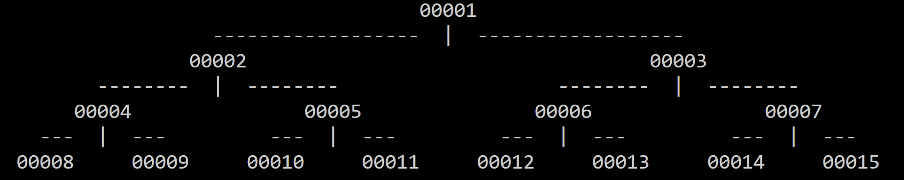
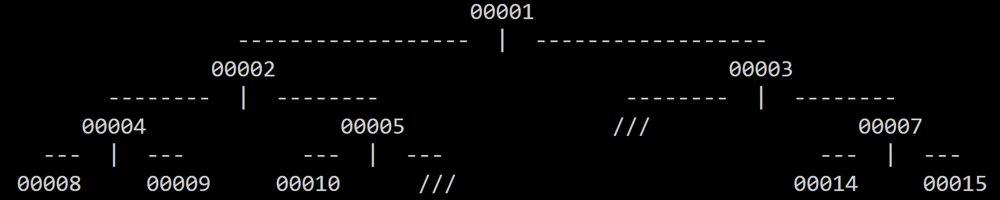

# Tree Visualization in C

## Description

This repository contains a C program to create and visualize binary trees. The
program builds a binary tree using a custom structure and prints it in a 2D grid
format. This can be particularly useful for educational purposes, debugging, and
understanding tree structures.

## Features

- Create a binary tree with nodes containing integer data.
- Calculate the height of the binary tree.
- Visualize the binary tree in a 2D grid format with nodes aligned to represent
  the tree structure.
- Automatic memory management for the tree nodes and visualization grid.

## Files

- `PrintTree.c`: Main source code file containing the implementation of the tree
  visualization.

## Usage

1. Clone the repository:
   ```sh
   git clone https://github.com/mounir19000/binary-tree-visualization-c.git
   cd binary-tree-visualization-c
   ```

## Previews




